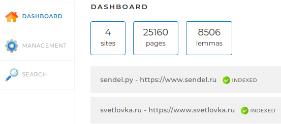

<h1 align="center">Search engine</h1>


## 1. Описание проекта

   Проект реализован по ТЗ компании Skillbox. Программа представляет собой вэб-приложение, разработанное на фреймворке Spring boot и предназначенное для индексации сайтов. 
Управление индексацией, статистика и поиск доступны через интерфейс Приложения. 
   Вэб-интерфейс содержит три раздела, доступные через вкладки:
- **Dashboard**,
- **Management**,
- **Search**.
  
**Dashboard:**   В разделе отражается статистика: какие сайты доступны для индексации, их количество и какие их них проиндексированы, количество проиндексированных страниц, количество лемм. Отображается как общая статистика, так и статистика по каждому сайту в отдельности через раскрывающийся блок.

**Management:**   В разделе доступна функциональность для запуска индексации всех сайтов и отдельной страницы, адрес которой вводится в поле Add/update page. Для запуска индексации по всем сайтам необходимо нажать кнопку “START INDEXING”. Для индексации отдельной страницы нужно воспользоваться полем ввода и кнопкой “ADD/UPDATE”. При этом необходимо учитывать, что проиндексирована(переиндексирована) может только отдельная страница, которая доступна на сайтах, указанных в файле свойств приложения. При запуске индексации сайта следует учитывать, что индексация сайта с количеством страниц более 5000, может занять достаточно продолжительное время, например сайт в 25000 страниц будет иедексироваться около 70 минут (как сайт svetlovka.ru, например). Небольшие сайты могут быть проиндексированы за несколько секунд (сайт sendel.ru (содержит 77 страницу) проиндексируется за 12 секунд).

**Search:**   Раздел предназначен для поиска фразы на проиндексированных сайтах, или, отдельно указанном через выпадающий список, сайте. Для запуска поиска небходимо нажать кнопку "SEARCH". Также следует учитывать, что для сайта с большим количеством страниц поиск может зянять несколько минут (от 5 минут). Для сайтов с небольшим количеством страниц поиск может занимать несколько секунд. Информация по каждой найденной стрнице содержит заголовок страницы и сниппет, который будет содержать слова из поискового запроса. Наиболее релевантные страницы будут выведены в списке первыми сверху.

Индексация происходит в три этапа:
- **Обход страниц сайтов.** Обход каждого сайта происходит в отдельном потоке, и обход всех страниц выполняется в многопоточном режиме. В итоге данные всех страниц созраняются в таблицу pages
- **Выделение лемм для каждого сайта.** Этап выявления лемм каждой страницы выполняется в отдельном потоке для каждой страницы. Леммы всех сайтов записываются в таблицу lemmas.
- **Индексация сайта**, т.е. подготовка данных, которые позволят определить релевантоность запроса. Данные результатов индексации сохраняются в таблицу indices 
В итоге проведенная индексация позволяет по поисковому запросу найти список страниц соотвествующих запросу.

## 2. Стек используемых технологий

   - Spring boot
   - Java Collection
   - Java Concurrency
   - Hibernate 
   - JPA
## 3. Инструкция по локальному запуску проекта

   - 1 Достать из репозитория  jar-файл приложения, файл application.yml
   - 2 Положить оба файла в одну папаку и запустить команду ниже(необходимо отредактировать пути к файлам java и к SearchEngine-1.0-SNAPSHOT.jar) команды ниже.
      ```
      ~/.jdks/corretto-17.0.11/bin/java -jar ~/1_IdeaProjects/searchengine/target/SearchEngine-1.0-SNAPSHOT.jar
      ```
   - 3 Установить систему управления базами данных mysql.
   - 4 Настроить файл конфигурации приложения application.yml:
       - указать логин, пароль и номер порта (обычно это порт 3306) как показано ниже:
      ```
      spring:
        datasource:
          username: [username]
          password: [password]
          url: jdbc:mysql://localhost:3306/search_engine?useSSL=false&requireSSL=false&allowPublicKeyRetrieval=true
      ```
   - Указать номер порта в application.yml(по умолчанию указан 8085), на котором должно запускаться приложение.И запустить приложение командой localhost:[номер порта] без квадратных скобок.

     ## 4. Инструкция по по сборке jar-файла приложения

Эта иснструкция для тех, кто пожелает самостоятельно собрать jar-файл
Поскольку глобальный репозиторий maven не работает и через него подключить библитеку Lucene не возможности, необходимо все библиотеки подключить через локальный репозиторий. Инструкция ниже.

Добавление библиотек Lucene в локальный репозиторий Maven
